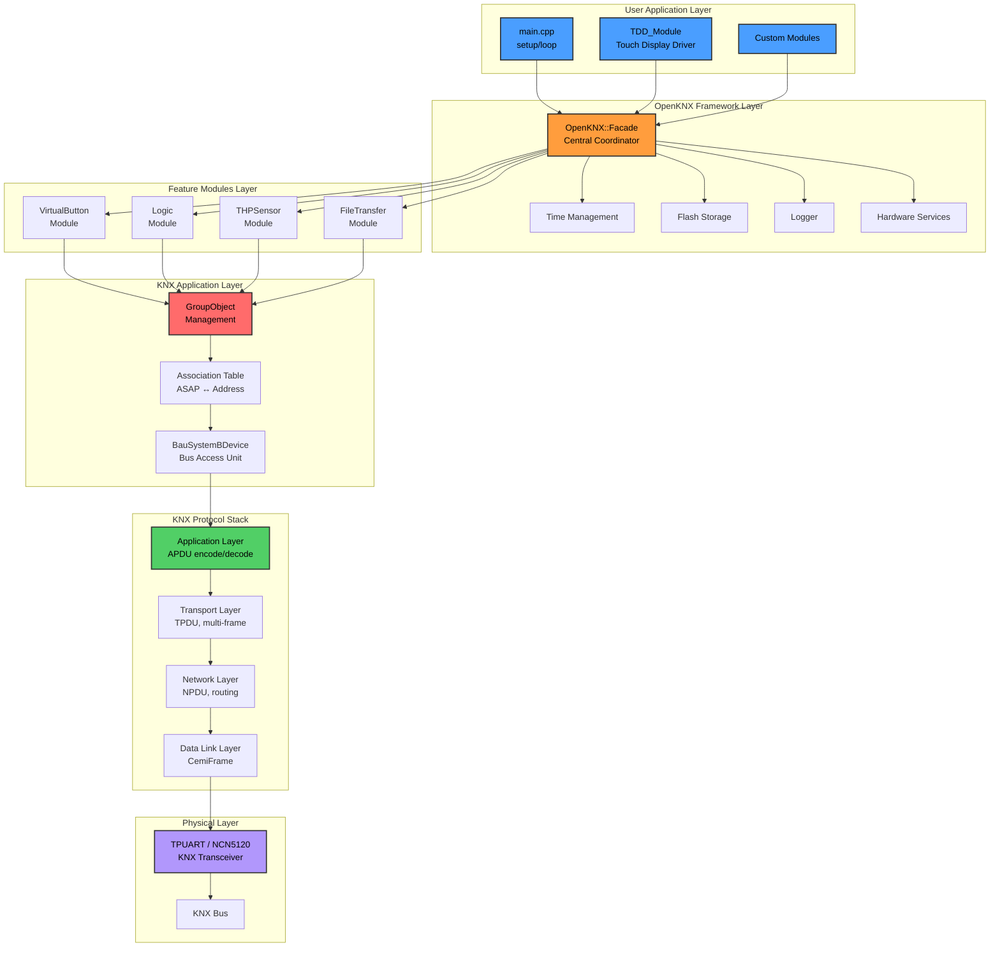

# Architecture Layers

```mermaid
flowchart TB
    subgraph UserApp["User Application Layer"]
        A["main.cpp<br/>setup/loop"]
        B["TDD_Module<br/>Touch Display Driver"]
        C["Custom Modules"]
    end

    subgraph Framework["OpenKNX Framework Layer"]
        D["OpenKNX::Facade<br/>Central Coordinator"]
        E["Time Management"]
        F["Flash Storage"]
        G["Logger"]
        H["Hardware Services"]
    end

    subgraph Modules["Feature Modules Layer"]
        I["VirtualButton<br/>Module"]
        J["Logic<br/>Module"]
        K["THPSensor<br/>Module"]
        L["FileTransfer<br/>Module"]
    end

    subgraph KNXApp["KNX Application Layer"]
        M["GroupObject<br/>Management"]
        N["Association Table<br/>ASAP ↔ Address"]
        O["BauSystemBDevice<br/>Bus Access Unit"]
    end

    subgraph Protocol["KNX Protocol Stack"]
        P["Application Layer<br/>APDU encode/decode"]
        Q["Transport Layer<br/>TPDU, multi-frame"]
        R["Network Layer<br/>NPDU, routing"]
        S["Data Link Layer<br/>CemiFrame"]
    end

    subgraph Physical["Physical Layer"]
        T["TPUART / NCN5120<br/>KNX Transceiver"]
        U["KNX Bus"]
    end

    A --> D
    B --> D
    C --> D
    D --> E
    D --> F
    D --> G
    D --> H
    D --> I
    D --> J
    D --> K
    D --> L
    I --> M
    J --> M
    K --> M
    L --> M
    M --> N
    N --> O
    O --> P
    P --> Q
    Q --> R
    R --> S
    S --> T
    T --> U

    style A fill:#4a9eff,stroke:#333,stroke-width:2px,color:#000
    style B fill:#4a9eff,stroke:#333,stroke-width:2px,color:#000
    style C fill:#4a9eff,stroke:#333,stroke-width:2px,color:#000
    style D fill:#ff9d3d,stroke:#333,stroke-width:2px,color:#000
    style M fill:#ff6b6b,stroke:#333,stroke-width:2px,color:#000
    style P fill:#51cf66,stroke:#333,stroke-width:2px,color:#000
    style T fill:#b197fc,stroke:#333,stroke-width:2px,color:#000
```
