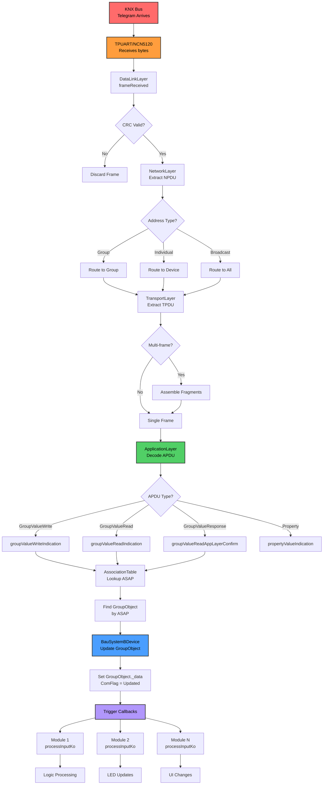

# Incoming Message Flow

```mermaid
flowchart TD
    A["KNX Bus<br/>Telegram Arrives"] --> B["TPUART/NCN5120<br/>Receives bytes"]
    B --> C["DataLinkLayer<br/>frameReceived"]

    C --> D{"CRC Valid?"}
    D -->|No| E["Discard Frame"]
    D -->|Yes| F["NetworkLayer<br/>Extract NPDU"]

    F --> G{"Address Type?"}
    G -->|Group| H["Route to Group"]
    G -->|Individual| I["Route to Device"]
    G -->|Broadcast| J["Route to All"]

    H --> K["TransportLayer<br/>Extract TPDU"]
    I --> K
    J --> K

    K --> L{"Multi-frame?"}
    L -->|Yes| M["Assemble Fragments"]
    L -->|No| N["Single Frame"]
    M --> N

    N --> O["ApplicationLayer<br/>Decode APDU"]

    O --> P{"APDU Type?"}
    P -->|GroupValueWrite| Q["groupValueWriteIndication"]
    P -->|GroupValueRead| R["groupValueReadIndication"]
    P -->|GroupValueResponse| S["groupValueReadAppLayerConfirm"]
    P -->|Property| T["propertyValueIndication"]

    Q --> U["AssociationTable<br/>Lookup ASAP"]
    R --> U
    S --> U

    U --> V["Find GroupObject<br/>by ASAP"]

    V --> W["BauSystemBDevice<br/>Update GroupObject"]

    W --> X["Set GroupObject._data<br/>ComFlag = Updated"]

    X --> Y["Trigger Callbacks"]

    Y --> Z1["Module 1<br/>processInputKo"]
    Y --> Z2["Module 2<br/>processInputKo"]
    Y --> Z3["Module N<br/>processInputKo"]

    Z1 --> AA1["Logic Processing"]
    Z2 --> AA2["LED Updates"]
    Z3 --> AA3["UI Changes"]

    style A fill:#ff6b6b,stroke:#333,stroke-width:2px,color:#000
    style B fill:#ff9d3d,stroke:#333,stroke-width:2px,color:#000
    style O fill:#51cf66,stroke:#333,stroke-width:2px,color:#000
    style W fill:#4a9eff,stroke:#333,stroke-width:2px,color:#000
    style Y fill:#b197fc,stroke:#333,stroke-width:2px,color:#000
```
