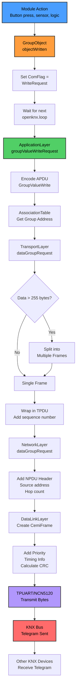

# Outgoing Message Flow

```mermaid
flowchart TD
    A["Module Action<br/>Button press, sensor, logic"] --> B["GroupObject<br/>objectWritten"]

    B --> C["Set ComFlag =<br/>WriteRequest"]

    C --> D["Wait for next<br/>openknx.loop"]

    D --> E["ApplicationLayer<br/>groupValueWriteRequest"]

    E --> F["Encode APDU<br/>GroupValueWrite"]

    F --> G["AssociationTable<br/>Get Group Address"]

    G --> H["TransportLayer<br/>dataGroupRequest"]

    H --> I{"Data > 255 bytes?"}
    I -->|Yes| J["Split into<br/>Multiple Frames"]
    I -->|No| K["Single Frame"]
    J --> K

    K --> L["Wrap in TPDU<br/>Add sequence number"]

    L --> M["NetworkLayer<br/>dataGroupRequest"]

    M --> N["Add NPDU Header<br/>Source address<br/>Hop count"]

    N --> O["DataLinkLayer<br/>Create CemiFrame"]

    O --> P["Add Priority<br/>Timing Info<br/>Calculate CRC"]

    P --> Q["TPUART/NCN5120<br/>Transmit Bytes"]

    Q --> R["KNX Bus<br/>Telegram Sent"]

    R --> S["Other KNX Devices<br/>Receive Telegram"]

    style A fill:#4a9eff,stroke:#333,stroke-width:2px,color:#000
    style B fill:#ff9d3d,stroke:#333,stroke-width:2px,color:#000
    style E fill:#51cf66,stroke:#333,stroke-width:2px,color:#000
    style Q fill:#b197fc,stroke:#333,stroke-width:2px,color:#000
    style R fill:#ff6b6b,stroke:#333,stroke-width:2px,color:#000
```
