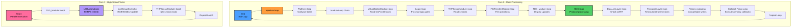

# Main Loop Cycle

```mermaid
flowchart TD
    subgraph Core0["Core 0 - Main Processing"]
        A["loop<br/>main.cpp"] --> B["openknx.loop"]

        B --> C["Platform::loop<br/>Hardware tasks"]

        C --> D["Module Loop Chain"]

        D --> E1["VirtualButtonModule::loop<br/>Read CAP1188 touch"]
        E1 --> E2["Logic::loop<br/>Process logic gates"]
        E2 --> E3["THPSensorModule::loop<br/>Read sensors"]
        E3 --> E4["FileTransferModule::loop<br/>File operations"]
        E4 --> E5["TDD_Module::loop<br/>Display updates"]

        E5 --> F["KNX::loop<br/>Protocol processing"]

        F --> G["DataLinkLayer::loop<br/>Check UART"]
        G --> H["TransportLayer::loop<br/>Timeouts/retransmissions"]
        H --> I["Process outgoing<br/>GroupObject writes"]

        I --> J["Callback Processing<br/>Execute pending callbacks"]

        J --> K["Repeat Loop"]
        K --> A
    end

    subgraph Core1["Core 1 - High-Speed Tasks"]
        L["loop1<br/>Parallel execution"] --> M["TDD_Module::loop1"]

        M --> N["LED Animations<br/>50 FPS refresh"]
        N --> O["LedGroupController<br/>RGB/SK6812 update"]

        O --> P["THPSensorModule::loop1<br/>I2C sensor reads"]

        P --> Q["Repeat Loop1"]
        Q --> L
    end

    style A fill:#4a9eff,stroke:#333,stroke-width:2px,color:#000
    style B fill:#ff9d3d,stroke:#333,stroke-width:2px,color:#000
    style F fill:#51cf66,stroke:#333,stroke-width:2px,color:#000
    style L fill:#ff6b9d,stroke:#333,stroke-width:2px,color:#000
    style N fill:#b197fc,stroke:#333,stroke-width:2px,color:#000
```
