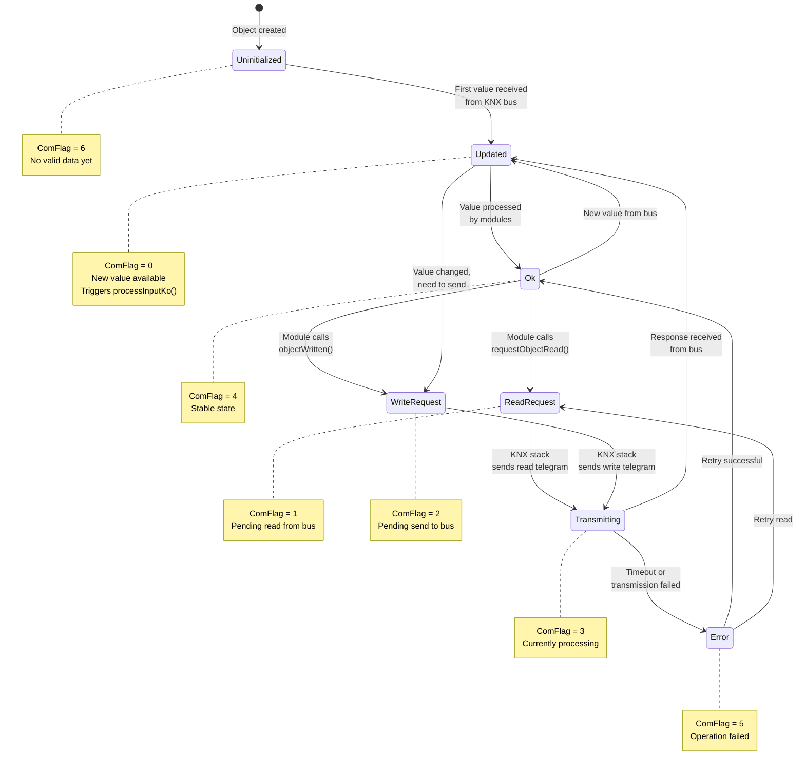

# GroupObject State Machine

```mermaid
stateDiagram-v2
    [*] --> Uninitialized: Object created

    Uninitialized --> Updated: First value received<br/>from KNX bus

    Updated --> Ok: Value processed<br/>by modules

    Ok --> ReadRequest: Module calls<br/>requestObjectRead()

    ReadRequest --> Transmitting: KNX stack<br/>sends read telegram

    Transmitting --> Updated: Response received<br/>from bus

    Transmitting --> Error: Timeout or<br/>transmission failed

    Ok --> WriteRequest: Module calls<br/>objectWritten()

    WriteRequest --> Transmitting: KNX stack<br/>sends write telegram

    Updated --> WriteRequest: Value changed,<br/>need to send

    Error --> Ok: Retry successful

    Error --> ReadRequest: Retry read

    Ok --> Updated: New value from bus

    note right of Uninitialized
        ComFlag = 6
        No valid data yet
    end note

    note right of Updated
        ComFlag = 0
        New value available
        Triggers processInputKo()
    end note

    note right of ReadRequest
        ComFlag = 1
        Pending read from bus
    end note

    note right of WriteRequest
        ComFlag = 2
        Pending send to bus
    end note

    note right of Transmitting
        ComFlag = 3
        Currently processing
    end note

    note right of Ok
        ComFlag = 4
        Stable state
    end note

    note right of Error
        ComFlag = 5
        Operation failed
    end note
```
