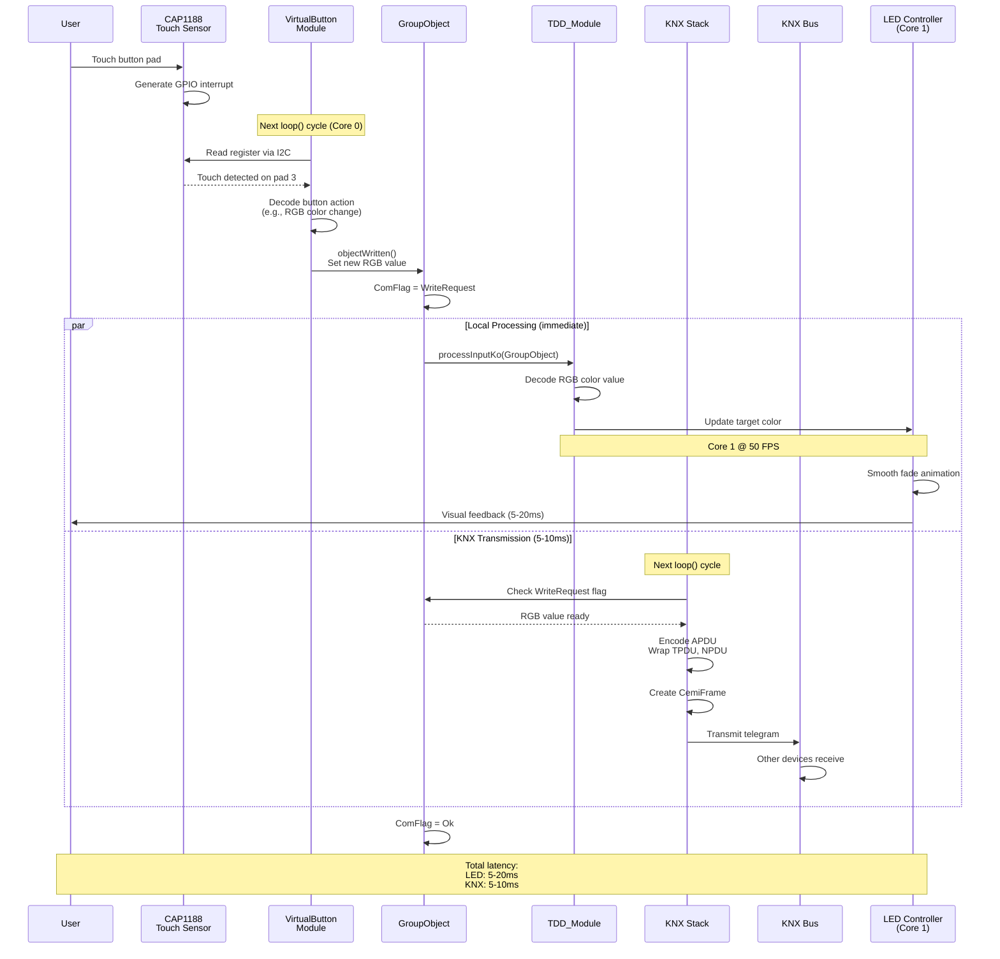

# Button Press Example

```mermaid
sequenceDiagram
    participant User
    participant CAP1188 as CAP1188<br/>Touch Sensor
    participant VBtn as VirtualButton<br/>Module
    participant GO as GroupObject
    participant TDD as TDD_Module
    participant KNX as KNX Stack
    participant Bus as KNX Bus
    participant LED as LED Controller<br/>(Core 1)

    User->>CAP1188: Touch button pad
    CAP1188->>CAP1188: Generate GPIO interrupt

    Note over VBtn: Next loop() cycle (Core 0)
    VBtn->>CAP1188: Read register via I2C
    CAP1188-->>VBtn: Touch detected on pad 3

    VBtn->>VBtn: Decode button action<br/>(e.g., RGB color change)
    VBtn->>GO: objectWritten()<br/>Set new RGB value
    GO->>GO: ComFlag = WriteRequest

    par Local Processing (immediate)
        GO->>TDD: processInputKo(GroupObject)
        TDD->>TDD: Decode RGB color value
        TDD->>LED: Update target color
        Note over LED,TDD: Core 1 @ 50 FPS
        LED->>LED: Smooth fade animation
        LED->>User: Visual feedback (5-20ms)
    and KNX Transmission (5-10ms)
        Note over KNX: Next loop() cycle
        KNX->>GO: Check WriteRequest flag
        GO-->>KNX: RGB value ready
        KNX->>KNX: Encode APDU<br/>Wrap TPDU, NPDU
        KNX->>KNX: Create CemiFrame
        KNX->>Bus: Transmit telegram
        Bus->>Bus: Other devices receive
    end

    GO->>GO: ComFlag = Ok

    Note over User,LED: Total latency:<br/>LED: 5-20ms<br/>KNX: 5-10ms
```
