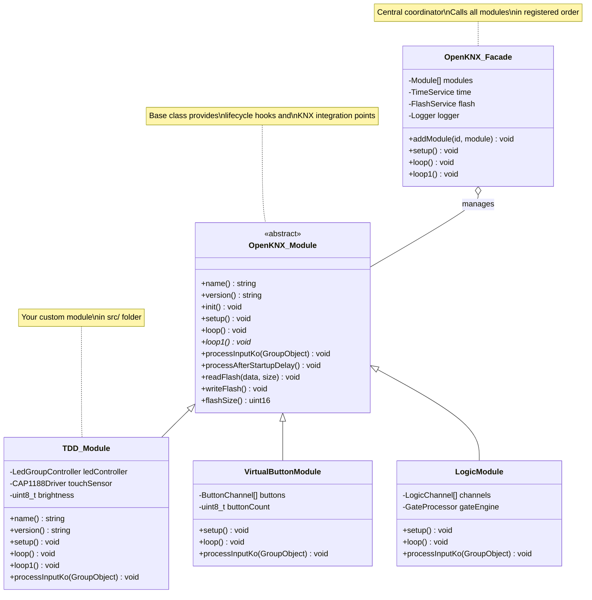

# Module Integration Pattern

```mermaid
classDiagram
    class OpenKNX_Module {
        <<abstract>>
        +name() string
        +version() string
        +init() void
        +setup() void
        +loop() void
        +loop1() void*
        +processInputKo(GroupObject) void
        +processAfterStartupDelay() void
        +readFlash(data, size) void
        +writeFlash() void
        +flashSize() uint16
    }

    class TDD_Module {
        -LedGroupController ledController
        -CAP1188Driver touchSensor
        -uint8_t brightness
        +name() string
        +version() string
        +setup() void
        +loop() void
        +loop1() void
        +processInputKo(GroupObject) void
    }

    class VirtualButtonModule {
        -ButtonChannel[] buttons
        -uint8_t buttonCount
        +setup() void
        +loop() void
        +processInputKo(GroupObject) void
    }

    class LogicModule {
        -LogicChannel[] channels
        -GateProcessor gateEngine
        +setup() void
        +loop() void
        +processInputKo(GroupObject) void
    }

    class OpenKNX_Facade {
        -Module[] modules
        -TimeService time
        -FlashService flash
        -Logger logger
        +addModule(id, module) void
        +setup() void
        +loop() void
        +loop1() void
    }

    OpenKNX_Module <|-- TDD_Module
    OpenKNX_Module <|-- VirtualButtonModule
    OpenKNX_Module <|-- LogicModule
    OpenKNX_Facade o-- OpenKNX_Module : manages

    note for OpenKNX_Module "Base class provides\nlifecycle hooks and\nKNX integration points"
    note for TDD_Module "Your custom module\nin src/ folder"
    note for OpenKNX_Facade "Central coordinator\nCalls all modules\nin registered order"
```
