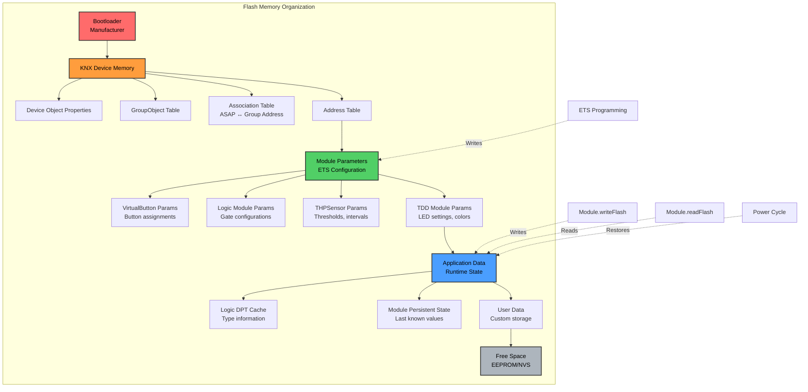

# Flash Memory Layout

```mermaid
flowchart TD
    subgraph Flash["Flash Memory Organization"]
        A["Bootloader<br/>Manufacturer"]

        A --> B["KNX Device Memory"]
        B --> B1["Device Object Properties"]
        B --> B2["GroupObject Table"]
        B --> B3["Association Table<br/>ASAP ↔ Group Address"]
        B --> B4["Address Table"]

        B4 --> C["Module Parameters<br/>ETS Configuration"]
        C --> C1["VirtualButton Params<br/>Button assignments"]
        C --> C2["Logic Module Params<br/>Gate configurations"]
        C --> C3["THPSensor Params<br/>Thresholds, intervals"]
        C --> C4["TDD Module Params<br/>LED settings, colors"]

        C4 --> D["Application Data<br/>Runtime State"]
        D --> D1["Logic DPT Cache<br/>Type information"]
        D --> D2["Module Persistent State<br/>Last known values"]
        D --> D3["User Data<br/>Custom storage"]

        D3 --> E["Free Space<br/>EEPROM/NVS"]
    end

    F["ETS Programming"] -.->|Writes| C
    G["Module.writeFlash"] -.->|Writes| D
    H["Module.readFlash"] -.->|Reads| D
    I["Power Cycle"] -.->|Restores| D

    style A fill:#ff6b6b,stroke:#333,stroke-width:2px,color:#000
    style B fill:#ff9d3d,stroke:#333,stroke-width:2px,color:#000
    style C fill:#51cf66,stroke:#333,stroke-width:2px,color:#000
    style D fill:#4a9eff,stroke:#333,stroke-width:2px,color:#000
    style E fill:#adb5bd,stroke:#333,stroke-width:2px,color:#000
```
