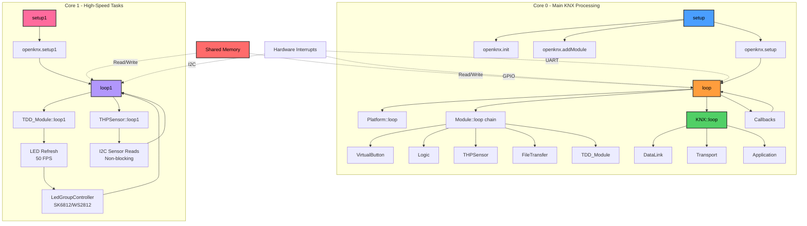

# Dual-Core Architecture

```mermaid
flowchart TB
    subgraph Core0["Core 0 - Main KNX Processing"]
        A["setup"]
        A --> B["openknx.init"]
        A --> C["openknx.addModule"]
        A --> D["openknx.setup"]

        D --> E["loop"]

        E --> F["Platform::loop"]
        E --> G["Module::loop chain"]
        E --> H["KNX::loop"]
        E --> I["Callbacks"]

        I --> E

        G --> G1["VirtualButton"]
        G --> G2["Logic"]
        G --> G3["THPSensor"]
        G --> G4["FileTransfer"]
        G --> G5["TDD_Module"]

        H --> H1["DataLink"]
        H --> H2["Transport"]
        H --> H3["Application"]
    end

    subgraph Core1["Core 1 - High-Speed Tasks"]
        J["setup1"]
        J --> K["openknx.setup1"]

        K --> L["loop1"]

        L --> M["TDD_Module::loop1"]
        M --> N["LED Refresh<br/>50 FPS"]
        N --> O["LedGroupController<br/>SK6812/WS2812"]

        L --> P["THPSensor::loop1"]
        P --> Q["I2C Sensor Reads<br/>Non-blocking"]

        Q --> L
        O --> L
    end

    R["Shared Memory"] -.->|Read/Write| E
    R -.->|Read/Write| L

    S["Hardware Interrupts"] -.->|GPIO| E
    S -.->|UART| E
    S -.->|I2C| L

    style A fill:#4a9eff,stroke:#333,stroke-width:2px,color:#000
    style E fill:#ff9d3d,stroke:#333,stroke-width:2px,color:#000
    style H fill:#51cf66,stroke:#333,stroke-width:2px,color:#000
    style J fill:#ff6b9d,stroke:#333,stroke-width:2px,color:#000
    style L fill:#b197fc,stroke:#333,stroke-width:2px,color:#000
    style R fill:#ff6b6b,stroke:#333,stroke-width:2px,color:#000
```
