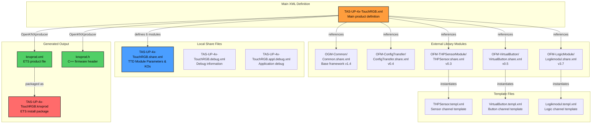

# XML File Structure

```mermaid
flowchart TB
    subgraph Main["Main XML Definition"]
        A["TAS-UP-4x-TouchRGB.xml<br/>Main product definition"]
    end

    subgraph Local["Local Share Files"]
        B["TAS-UP-4x-TouchRGB.share.xml<br/>TTD Module Parameters & KOs"]
        C["TAS-UP-4x-TouchRGB.debug.xml<br/>Debug information"]
        D["TAS-UP-4x-TouchRGB.appl.debug.xml<br/>Application debug"]
    end

    subgraph External["External Library Modules"]
        E["OGM-Common/<br/>Common.share.xml<br/>Base framework v1.4"]
        F["OFM-ConfigTransfer/<br/>ConfigTransfer.share.xml<br/>v0.4"]
        G["OFM-THPSensorModule/<br/>THPSensor.share.xml<br/>v0.3"]
        H["OFM-VirtualButton/<br/>VirtualButton.share.xml<br/>v0.5"]
        I["OFM-LogicModule/<br/>Logikmodul.share.xml<br/>v3.7"]
    end

    subgraph Templates["Template Files"]
        J["THPSensor.templ.xml<br/>Sensor channel template"]
        K["VirtualButton.templ.xml<br/>Button channel template"]
        L["Logikmodul.templ.xml<br/>Logic channel template"]
    end

    subgraph Output["Generated Output"]
        M["knxprod.xml<br/>ETS product file"]
        N["knxprod.h<br/>C++ firmware header"]
        O["TAS-UP-4x-TouchRGB.knxprod<br/>ETS install package"]
    end

    A -->|defines 6 modules| B
    A -->|references| E
    A -->|references| F
    A -->|references| G
    A -->|references| H
    A -->|references| I

    G -->|instantiates| J
    H -->|instantiates| K
    I -->|instantiates| L

    A -->|OpenKNXproducer| M
    A -->|OpenKNXproducer| N
    M -->|packaged as| O

    style A fill:#ff9d3d,stroke:#333,stroke-width:2px,color:#000
    style B fill:#4a9eff,stroke:#333,stroke-width:2px,color:#000
    style M fill:#51cf66,stroke:#333,stroke-width:2px,color:#000
    style N fill:#51cf66,stroke:#333,stroke-width:2px,color:#000
    style O fill:#ff6b6b,stroke:#333,stroke-width:2px,color:#000
```
