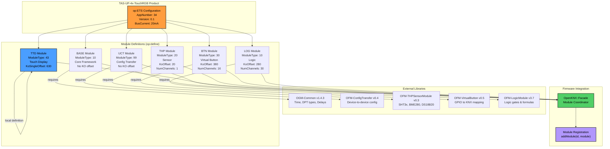

# Module Hierarchy and Dependencies

```mermaid
flowchart TB
    subgraph Product["TAS-UP-4x-TouchRGB Product"]
        A["op:ETS Configuration<br/>AppNumber: 34<br/>Version: 0.1<br/>BusCurrent: 20mA"]
    end

    subgraph Modules["Module Definitions (op:define)"]
        B["BASE Module<br/>ModuleType: 10<br/>Core Framework<br/>No KO offset"]
        C["UCT Module<br/>ModuleType: 99<br/>Config Transfer<br/>No KO offset"]
        D["TTD Module<br/>ModuleType: 43<br/>Touch Display<br/>KoSingleOffset: 630"]
        E["THP Module<br/>ModuleType: 20<br/>Sensor<br/>KoOffset: 20<br/>NumChannels: 1"]
        F["BTN Module<br/>ModuleType: 30<br/>Virtual Button<br/>KoOffset: 380<br/>NumChannels: 16"]
        G["LOG Module<br/>ModuleType: 10<br/>Logic<br/>KoOffset: 280<br/>NumChannels: 30"]
    end

    subgraph Libraries["External Libraries"]
        H["OGM-Common v1.4.3<br/>Time, DPT types, Delays"]
        I["OFM-ConfigTransfer v0.4<br/>Device-to-device config"]
        J["OFM-THPSensorModule v0.3<br/>SHT3x, BME280, DS18B20"]
        K["OFM-VirtualButton v0.5<br/>GPIO to KNX mapping"]
        L["OFM-LogicModule v3.7<br/>Logic gates & formulas"]
    end

    subgraph Firmware["Firmware Integration"]
        M["OpenKNX::Facade<br/>Module Coordinator"]
        N["Module Registration<br/>addModule(id, module)"]
    end

    A --> B
    A --> C
    A --> D
    A --> E
    A --> F
    A --> G

    B -->|requires| H
    C -->|requires| I
    D -->|local definition| D
    E -->|requires| J
    F -->|requires| K
    G -->|requires| L

    B --> M
    C --> M
    D --> M
    E --> M
    F --> M
    G --> M

    M --> N

    style A fill:#ff9d3d,stroke:#333,stroke-width:2px,color:#000
    style D fill:#4a9eff,stroke:#333,stroke-width:2px,color:#000
    style M fill:#51cf66,stroke:#333,stroke-width:2px,color:#000
    style N fill:#b197fc,stroke:#333,stroke-width:2px,color:#000
```
