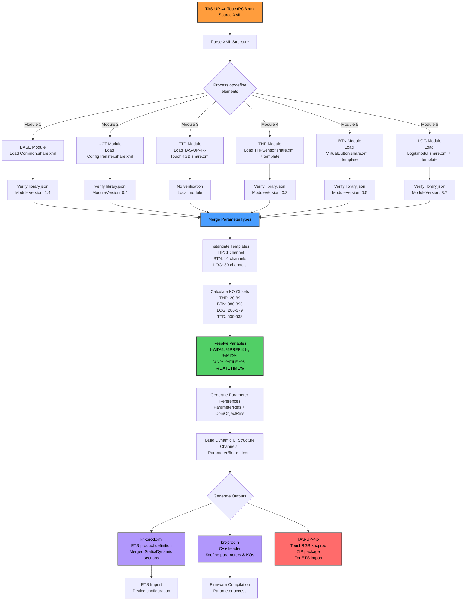

# OpenKNXproducer Build Pipeline

```mermaid
flowchart TD
    A["TAS-UP-4x-TouchRGB.xml<br/>Source XML"] --> B["Parse XML Structure"]

    B --> C{"Process op:define<br/>elements"}

    C -->|Module 1| D1["BASE Module<br/>Load Common.share.xml"]
    C -->|Module 2| D2["UCT Module<br/>Load ConfigTransfer.share.xml"]
    C -->|Module 3| D3["TTD Module<br/>Load TAS-UP-4x-TouchRGB.share.xml"]
    C -->|Module 4| D4["THP Module<br/>Load THPSensor.share.xml + template"]
    C -->|Module 5| D5["BTN Module<br/>Load VirtualButton.share.xml + template"]
    C -->|Module 6| D6["LOG Module<br/>Load Logikmodul.share.xml + template"]

    D1 --> E1["Verify library.json<br/>ModuleVersion: 1.4"]
    D2 --> E2["Verify library.json<br/>ModuleVersion: 0.4"]
    D3 --> E3["No verification<br/>Local module"]
    D4 --> E4["Verify library.json<br/>ModuleVersion: 0.3"]
    D5 --> E5["Verify library.json<br/>ModuleVersion: 0.5"]
    D6 --> E6["Verify library.json<br/>ModuleVersion: 3.7"]

    E1 --> F["Merge ParameterTypes"]
    E2 --> F
    E3 --> F
    E4 --> F
    E5 --> F
    E6 --> F

    F --> G["Instantiate Templates<br/>THP: 1 channel<br/>BTN: 16 channels<br/>LOG: 30 channels"]

    G --> H["Calculate KO Offsets<br/>THP: 20-39<br/>BTN: 380-395<br/>LOG: 280-379<br/>TTD: 630-638"]

    H --> I["Resolve Variables<br/>%AID%, %PREFIX%, %MID%<br/>%N%, %FILE-*%, %DATETIME%"]

    I --> J["Generate Parameter References<br/>ParameterRefs + ComObjectRefs"]

    J --> K["Build Dynamic UI Structure<br/>Channels, ParameterBlocks, Icons"]

    K --> L{"Generate Outputs"}

    L --> M1["knxprod.xml<br/>ETS product definition<br/>Merged Static/Dynamic sections"]
    L --> M2["knxprod.h<br/>C++ header<br/>#define parameters & KOs"]
    L --> M3["TAS-UP-4x-TouchRGB.knxprod<br/>ZIP package<br/>For ETS import"]

    M1 --> N["ETS Import<br/>Device configuration"]
    M2 --> O["Firmware Compilation<br/>Parameter access"]

    style A fill:#ff9d3d,stroke:#333,stroke-width:2px,color:#000
    style F fill:#4a9eff,stroke:#333,stroke-width:2px,color:#000
    style I fill:#51cf66,stroke:#333,stroke-width:2px,color:#000
    style M1 fill:#b197fc,stroke:#333,stroke-width:2px,color:#000
    style M2 fill:#b197fc,stroke:#333,stroke-width:2px,color:#000
    style M3 fill:#ff6b6b,stroke:#333,stroke-width:2px,color:#000
```
