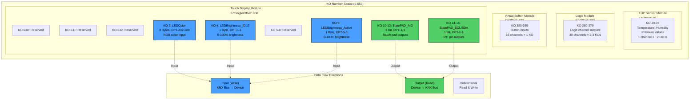

# Communication Objects (KO) Layout

```mermaid
flowchart TB
    subgraph KOLayout["KO Number Space (0-650)"]
        direction TB

        subgraph THP["THP Sensor Module<br/>KoOffset: 20"]
            K20["KO 20-39<br/>Temperature, Humidity<br/>Pressure values<br/>1 channel × ~20 KOs"]
        end

        subgraph LOG["Logic Module<br/>KoOffset: 280"]
            K280["KO 280-379<br/>Logic channel outputs<br/>30 channels × 2-3 KOs"]
        end

        subgraph BTN["Virtual Button Module<br/>KoOffset: 380"]
            K380["KO 380-395<br/>Button inputs<br/>16 channels × 1 KO"]
        end

        subgraph TTD["Touch Display Module<br/>KoSingleOffset: 630"]
            K630["KO 630: Reserved"]
            K631["KO 631: Reserved"]
            K632["KO 632: Reserved"]
            K633["KO 3: LEDColor<br/>3 Bytes, DPT-232-600<br/>RGB color input"]
            K634["KO 4: LEDBrightness_IDLE<br/>1 Byte, DPT-5-1<br/>0-100% brightness"]
            K635["KO 5-8: Reserved"]
            K636["KO 9: LEDBrightness_Active<br/>1 Byte, DPT-5-1<br/>0-100% brightness"]
            K637["KO 10-13: StatePAD_A-D<br/>1 Bit, DPT-1-1<br/>Touch pad outputs"]
            K638["KO 14-15: StatePAD_SCL/SDA<br/>1 Bit, DPT-1-1<br/>I2C pin outputs"]
        end
    end

    subgraph Directions["Data Flow Directions"]
        IN["Input (Write)<br/>KNX Bus → Device"]
        OUT["Output (Read)<br/>Device → KNX Bus"]
        BOTH["Bidirectional<br/>Read & Write"]
    end

    K633 -.->|Input| IN
    K634 -.->|Input| IN
    K636 -.->|Input| IN
    K637 -.->|Output| OUT
    K638 -.->|Output| OUT

    style K633 fill:#4a9eff,stroke:#333,stroke-width:2px,color:#000
    style K634 fill:#4a9eff,stroke:#333,stroke-width:2px,color:#000
    style K636 fill:#4a9eff,stroke:#333,stroke-width:2px,color:#000
    style K637 fill:#51cf66,stroke:#333,stroke-width:2px,color:#000
    style K638 fill:#51cf66,stroke:#333,stroke-width:2px,color:#000
    style IN fill:#4a9eff,stroke:#333,stroke-width:1px,color:#000
    style OUT fill:#51cf66,stroke:#333,stroke-width:1px,color:#000
```
