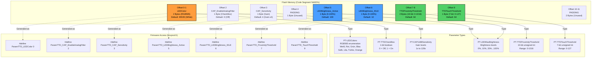

# Parameter Memory Layout (TTD Module)

```mermaid
flowchart TB
    subgraph Flash["Flash Memory (Code Segment %MID%)"]
        direction TB

        M0["Offset 0-1<br/>LEDColor<br/>2 Bytes (RGB565)<br/>Default: 65535 (White)"]
        M1["Offset 2<br/>CAP_EnableAnalogFilter<br/>1 Byte (CheckBox)<br/>Default: 0 (Off)"]
        M2["Offset 3<br/>CAP_Sensitivity<br/>1 Byte (Gain)<br/>Default: 4 (Gain x4)"]
        M3["Offset 4<br/>PADDING<br/>1 Byte (Unused)"]
        M4["Offset 5<br/>LEDBrightness_Active<br/>1 Byte (0-100%)<br/>Default: 100"]
        M5["Offset 6<br/>LEDBrightness_IDLE<br/>1 Byte (0-100%)<br/>Default: 10"]
        M6["Offset 7-8<br/>TTDProximityThreshold<br/>2 Bytes (10-bit: 0-1016)<br/>Default: 64"]
        M7["Offset 9<br/>TTDTouchThreshold<br/>1 Byte (7-bit: 0-127)<br/>Default: 64"]
        M8["Offset 10-11<br/>PADDING<br/>2 Bytes (Unused)"]
    end

    subgraph Types["Parameter Types"]
        T1["PT-LEDColors<br/>RGB565 enumeration<br/>Weiß, Rot, Grün, Blau<br/>Gelb, Lila, Türkis, Orange"]
        T2["PT-TTDCheckBox<br/>1-bit boolean<br/>0 = Off, 1 = On"]
        T3["PT-CAP1188Sensitivity<br/>Gain levels<br/>1x to 128x"]
        T4["PT-LEDMaxBrightness<br/>Brightness levels<br/>0%, 10%, 20%...100%"]
        T5["PT-TTDProximityThreshold<br/>10-bit unsigned int<br/>Range: 0-1016"]
        T6["PT-TTDTouchThreshold<br/>7-bit unsigned int<br/>Range: 0-127"]
    end

    M0 -->|Type| T1
    M1 -->|Type| T2
    M2 -->|Type| T3
    M4 -->|Type| T4
    M5 -->|Type| T4
    M6 -->|Type| T5
    M7 -->|Type| T6

    subgraph Firmware["Firmware Access (knxprod.h)"]
        F1["#define ParamTTD_LEDColor 0"]
        F2["#define ParamTTD_CAP_EnableAnalogFilter 2"]
        F3["#define ParamTTD_CAP_Sensitivity 3"]
        F4["#define ParamTTD_LEDBrightness_Active 5"]
        F5["#define ParamTTD_LEDBrightness_IDLE 6"]
        F6["#define ParamTTD_ProximityThreshold 7"]
        F7["#define ParamTTD_TouchThreshold 9"]
    end

    M0 -.->|Generated as| F1
    M1 -.->|Generated as| F2
    M2 -.->|Generated as| F3
    M4 -.->|Generated as| F4
    M5 -.->|Generated as| F5
    M6 -.->|Generated as| F6
    M7 -.->|Generated as| F7

    style M0 fill:#ff9d3d,stroke:#333,stroke-width:2px,color:#000
    style M4 fill:#4a9eff,stroke:#333,stroke-width:2px,color:#000
    style M5 fill:#4a9eff,stroke:#333,stroke-width:2px,color:#000
    style M6 fill:#51cf66,stroke:#333,stroke-width:2px,color:#000
    style M7 fill:#51cf66,stroke:#333,stroke-width:2px,color:#000
```
