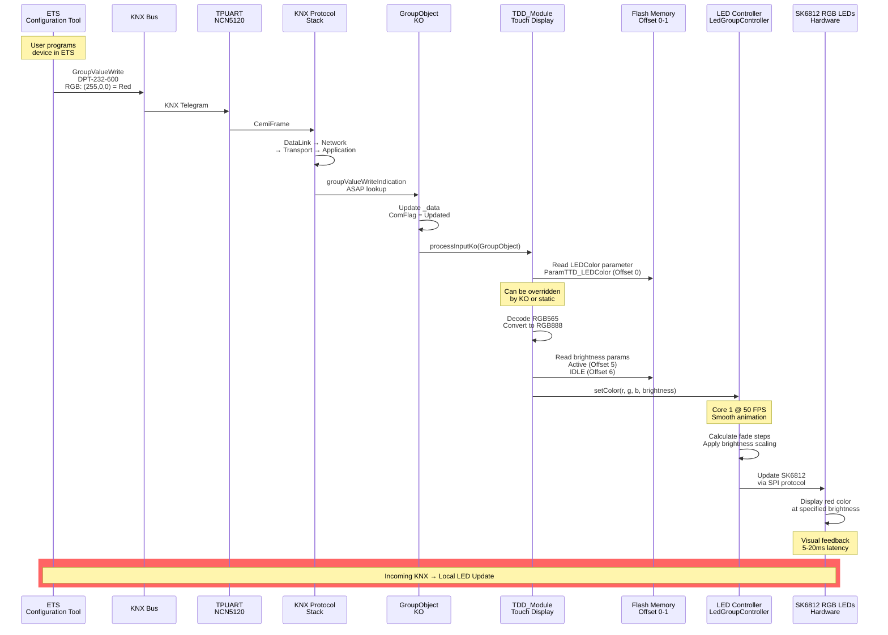

# Data Flow Example: LED Color Control

```mermaid
sequenceDiagram
    participant ETS as ETS<br/>Configuration Tool
    participant Bus as KNX Bus
    participant TPUART as TPUART<br/>NCN5120
    participant Stack as KNX Protocol<br/>Stack
    participant KO as GroupObject<br/>KO #3 LEDColor
    participant TTD as TDD_Module<br/>Touch Display
    participant Mem as Flash Memory<br/>Offset 0-1
    participant LED as LED Controller<br/>LedGroupController
    participant HW as SK6812 RGB LEDs<br/>Hardware

    Note over ETS: User programs<br/>device in ETS
    ETS->>Bus: GroupValueWrite<br/>DPT-232-600<br/>RGB: (255,0,0) = Red

    Bus->>TPUART: KNX Telegram
    TPUART->>Stack: CemiFrame

    Stack->>Stack: DataLink → Network<br/>→ Transport → Application

    Stack->>KO: groupValueWriteIndication<br/>ASAP lookup

    KO->>KO: Update _data<br/>ComFlag = Updated

    KO->>TTD: processInputKo(GroupObject)

    TTD->>Mem: Read LEDColor parameter<br/>ParamTTD_LEDColor (Offset 0)

    Note over TTD: Can be overridden<br/>by KO or static

    TTD->>TTD: Decode RGB565<br/>Convert to RGB888

    TTD->>Mem: Read brightness params<br/>Active (Offset 5)<br/>IDLE (Offset 6)

    TTD->>LED: setColor(r, g, b, brightness)

    Note over LED: Core 1 @ 50 FPS<br/>Smooth animation

    LED->>LED: Calculate fade steps<br/>Apply brightness scaling

    LED->>HW: Update SK6812<br/>via SPI protocol

    HW->>HW: Display red color<br/>at specified brightness

    Note over HW: Visual feedback<br/>5-20ms latency

    rect rgb(255, 100, 100)
        Note over ETS,HW: Incoming KNX → Local LED Update
    end
```
