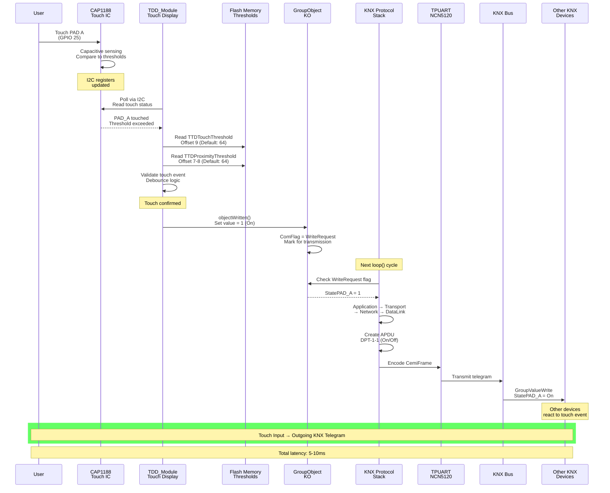

# Data Flow Example: Touch PAD Output

```mermaid
sequenceDiagram
    participant User
    participant HW as CAP1188<br/>Touch IC
    participant TTD as TDD_Module<br/>Touch Display
    participant Mem as Flash Memory<br/>Thresholds
    participant KO as GroupObject<br/>KO #10 StatePAD_A
    participant Stack as KNX Protocol<br/>Stack
    participant TPUART as TPUART<br/>NCN5120
    participant Bus as KNX Bus
    participant ETS as Other KNX<br/>Devices

    User->>HW: Touch PAD A<br/>(GPIO 25)

    HW->>HW: Capacitive sensing<br/>Compare to thresholds

    Note over HW: I2C registers<br/>updated

    TTD->>HW: Poll via I2C<br/>Read touch status

    HW-->>TTD: PAD_A touched<br/>Threshold exceeded

    TTD->>Mem: Read TTDTouchThreshold<br/>Offset 9 (Default: 64)

    TTD->>Mem: Read TTDProximityThreshold<br/>Offset 7-8 (Default: 64)

    TTD->>TTD: Validate touch event<br/>Debounce logic

    Note over TTD: Touch confirmed

    TTD->>KO: objectWritten()<br/>Set value = 1 (On)

    KO->>KO: ComFlag = WriteRequest<br/>Mark for transmission

    Note over Stack: Next loop() cycle

    Stack->>KO: Check WriteRequest flag
    KO-->>Stack: StatePAD_A = 1

    Stack->>Stack: Application → Transport<br/>→ Network → DataLink

    Stack->>Stack: Create APDU<br/>DPT-1-1 (On/Off)

    Stack->>TPUART: Encode CemiFrame

    TPUART->>Bus: Transmit telegram

    Bus->>ETS: GroupValueWrite<br/>StatePAD_A = On

    Note over ETS: Other devices<br/>react to touch event

    rect rgb(100, 255, 100)
        Note over User,ETS: Touch Input → Outgoing KNX Telegram
    end

    Note over User,ETS: Total latency: 5-10ms
```
